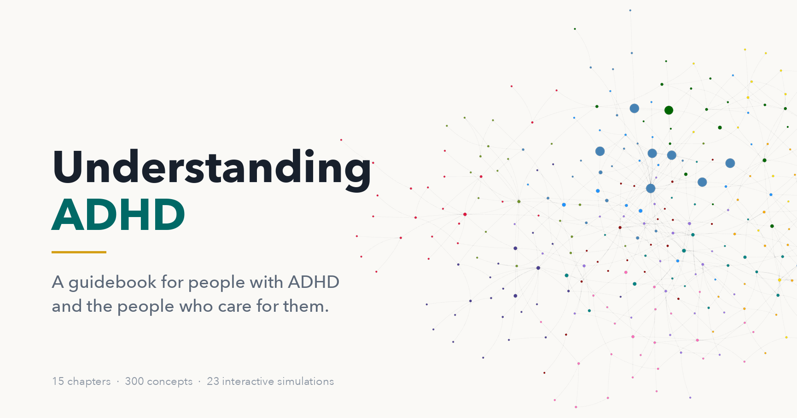

# Understanding ADHD

<figure markdown>
  { width="100%" }
</figure>

**A guidebook for people with ADHD and the people who care for them.**

An ADHD diagnosis lands on more than one person. This book is written for two
readers at once — the person who has ADHD, and the parent, partner, sibling, or
friend trying to figure out how to help. Every major topic covers both sides.

No medical background needed. Every term is explained the first time it
appears.

## Start Here

-   **Just diagnosed, or newly suspecting it**

    Start with [Chapter 1: What ADHD Is And Is Not](chapters/01-what-adhd-is/index.md),
    then [Chapter 2: The ADHD Brain](chapters/02-the-adhd-brain/index.md).

-   **You love someone with ADHD**

    Read [Chapter 14: Family Life And Communication](chapters/14-family-life/index.md)
    first, then start from the beginning.

-   **Diagnosed late, as an adult**

    [Chapter 4: ADHD Across The Lifespan](chapters/04-adhd-across-the-lifespan/index.md)
    and [Chapter 11: Emotional Life And Identity](chapters/11-emotional-life-and-identity/index.md).

-   **Here with an urgent question**

    Try the [FAQ](faq.md) — 108 questions with answers that link back into the
    chapters.

## What's Inside

- **[15 chapters](chapters/index.md)** — from the science of attention through
  medication, daily systems, school and work, family life, and partnership.
- **[23 interactive MicroSims](sims/index.md)** — feel time slip away in the
  Time Blindness Challenge, or watch the executive-function system work under
  load. Faster than any description.
- **[A learning graph](learning-graph/index.md)** — all 300 concepts and how
  they depend on each other, explorable as a map.
- **[Glossary](glossary.md)** — 300 terms in plain language.
- **[FAQ](faq.md)** — 108 real questions, answered.
- **Two quizzes per chapter** — one to check your reading, one that puts you in
  real situations — plus annotated references throughout.

## How It Ends

The last chapter asks each reader to write one document. The person with ADHD
writes a **personal owner's manual** — how my brain works, what helps, what
hurts, what I need from you. The people around them write a **family support
plan** — what we'll do, what we'll stop doing, and where our limits are.

Then you trade them.

## About This Book

More on who it's for, how to read it, and what it deliberately does not
attempt is on the [About page](about.md). This book explains — it does not
diagnose or prescribe. If you are in crisis, contact a clinician, or in the US
call or text **988**.

Free and openly licensed under
[CC BY-NC-SA 4.0](https://creativecommons.org/licenses/by-nc-sa/4.0/).
