# MicroSims

MicroSims are small, interactive educational simulations — each one focused on
a single concept. They live under `docs/sims/<sim-name>/` and are embedded
into chapters via iframes.

New MicroSims can be created with the `microsim-generator` skill, which routes
to the appropriate library (p5.js, Chart.js, vis-network, Mermaid, Leaflet,
Plotly, Venn.js).

## Catalog

All 23 MicroSims are implemented and live. Click any card to open the sim's
page, which has the embedded simulation, a fullscreen link, and a lesson plan.

[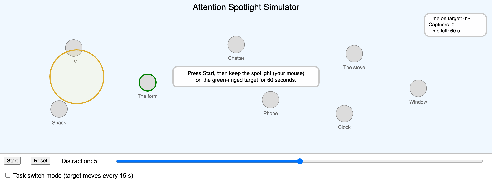](attention-spotlight-simulator/index.md)

**[Attention Spotlight Simulator](attention-spotlight-simulator/index.md)**   Chapter 1 · p5.js

[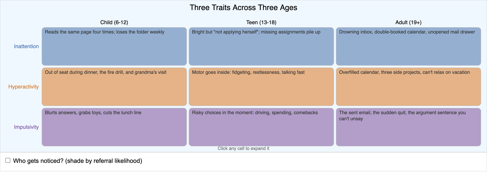](three-traits-explorer/index.md)

**[Three Traits Across Three Ages Explorer](three-traits-explorer/index.md)**   Chapter 1 · p5.js

[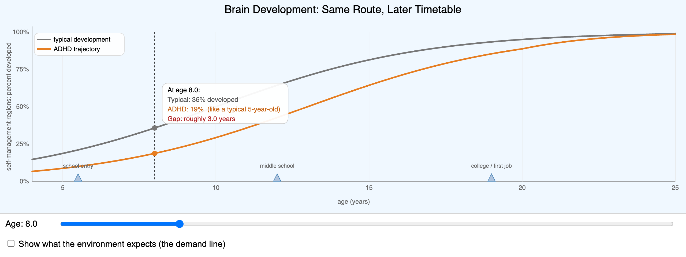](brain-development-timeline/index.md)

**[Brain Development Timeline](brain-development-timeline/index.md)**   Chapter 1 · p5.js

[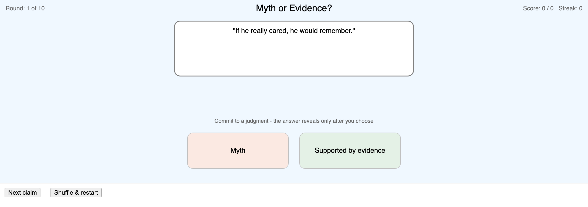](myth-or-evidence-sorter/index.md)

**[Myth or Evidence Sorter](myth-or-evidence-sorter/index.md)**   Chapter 1 · p5.js

[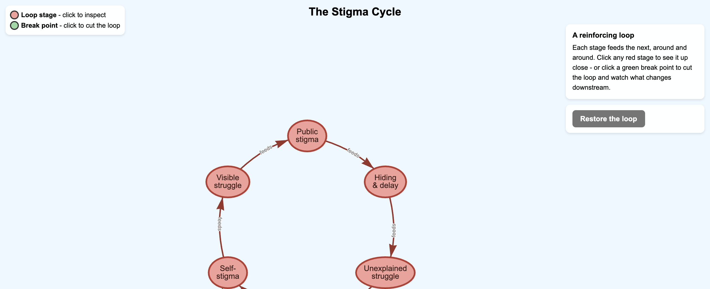](stigma-cycle-diagram/index.md)

**[The Stigma Cycle](stigma-cycle-diagram/index.md)**   Chapter 1 · vis-network

[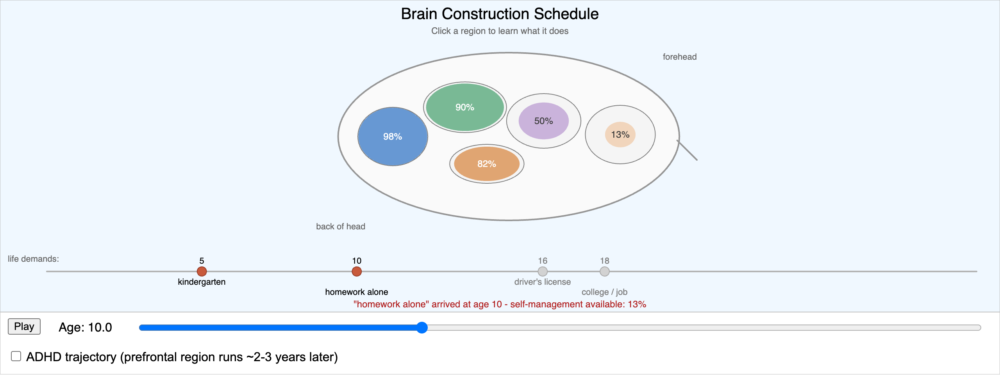](brain-construction-explorer/index.md)

**[Brain Construction Schedule Explorer](brain-construction-explorer/index.md)**   Chapter 2 · p5.js

[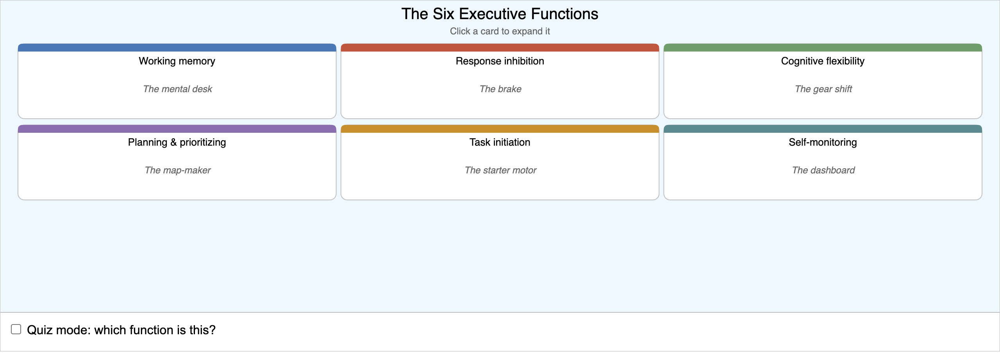](executive-function-explorer/index.md)

**[Executive Function Explorer](executive-function-explorer/index.md)**   Chapter 2 · p5.js

[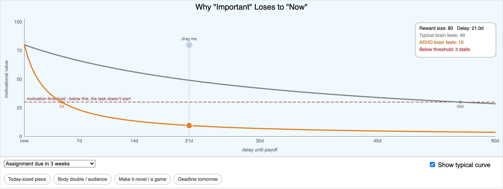](reward-discounting-simulator/index.md)

**[Reward Discounting Simulator](reward-discounting-simulator/index.md)**   Chapter 2 · p5.js

[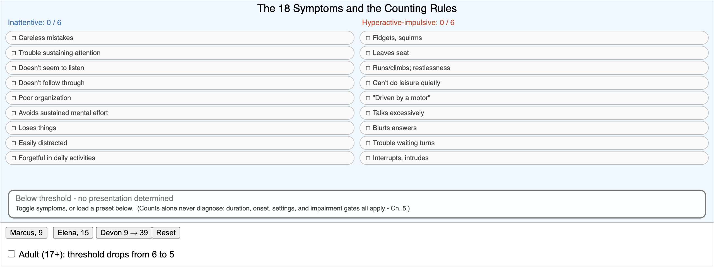](symptom-presentation-explorer/index.md)

**[Symptom and Presentation Explorer](symptom-presentation-explorer/index.md)**   Chapter 3 · p5.js

[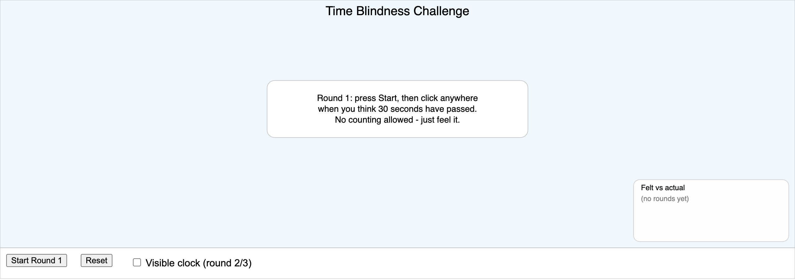](time-blindness-challenge/index.md)

**[Time Blindness Challenge](time-blindness-challenge/index.md)**   Chapter 3 · p5.js

[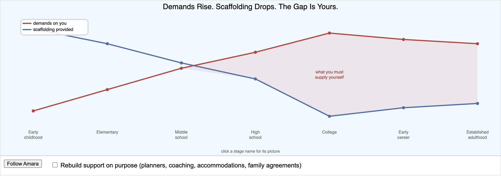](lifespan-scaffolding-explorer/index.md)

**[Lifespan Demands and Scaffolding Explorer](lifespan-scaffolding-explorer/index.md)**   Chapter 4 · p5.js

[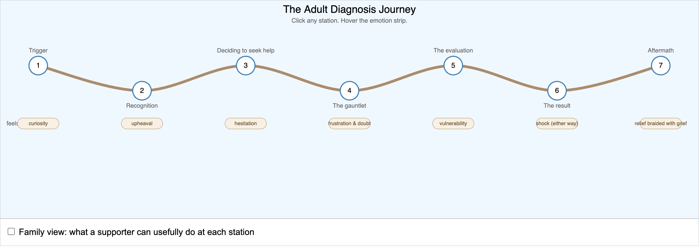](adult-diagnosis-journey-map/index.md)

**[The Adult Diagnosis Journey Map](adult-diagnosis-journey-map/index.md)**   Chapter 4 · p5.js

[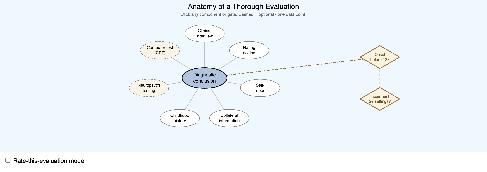](evaluation-anatomy-map/index.md)

**[Anatomy of a Thorough Evaluation](evaluation-anatomy-map/index.md)**   Chapter 5 · p5.js

[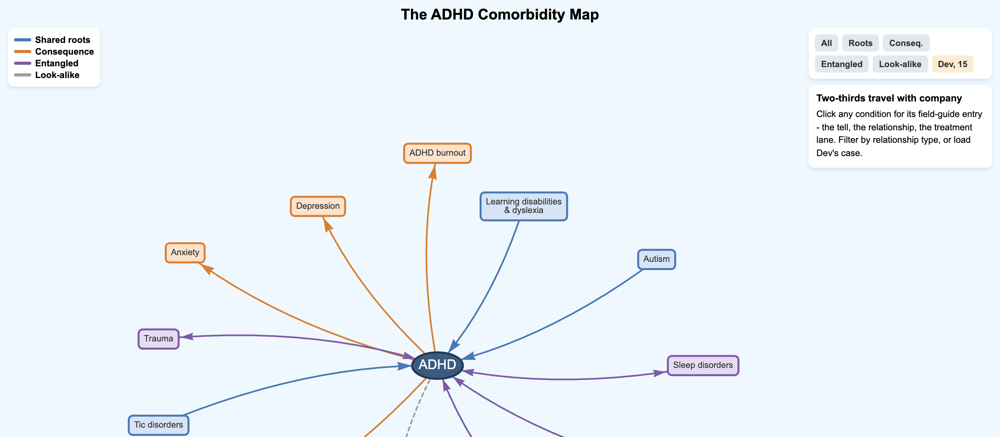](comorbidity-map/index.md)

**[The ADHD Comorbidity Map](comorbidity-map/index.md)**   Chapter 6 · vis-network

[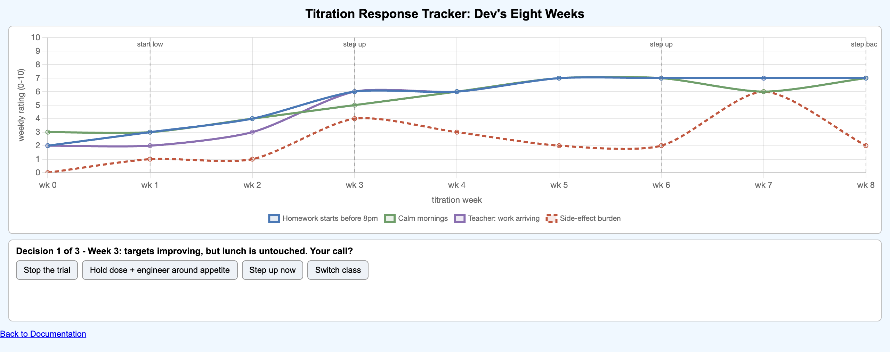](titration-response-tracker/index.md)

**[Titration Response Tracker](titration-response-tracker/index.md)**   Chapter 7 · Chart.js

[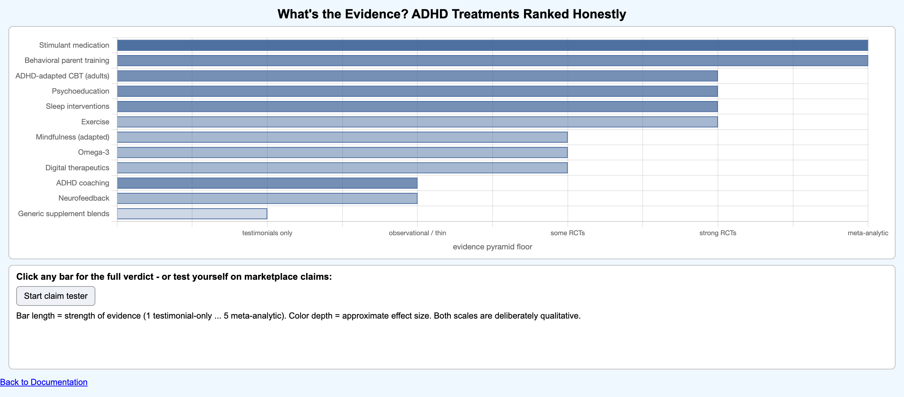](treatment-evidence-explorer/index.md)

**[Treatment Evidence Explorer](treatment-evidence-explorer/index.md)**   Chapter 8 · Chart.js

[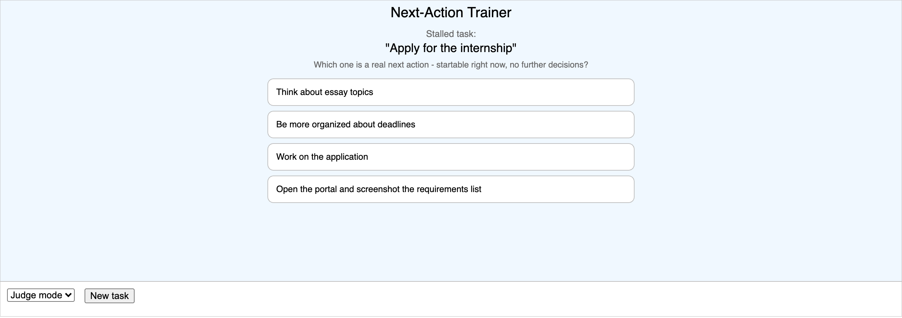](next-action-trainer/index.md)

**[Next-Action Trainer](next-action-trainer/index.md)**   Chapter 9 · p5.js

[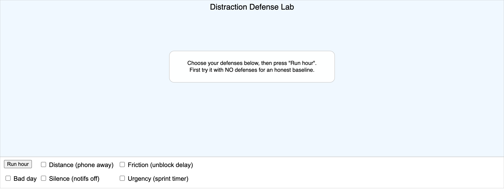](distraction-defense-lab/index.md)

**[Distraction Defense Lab](distraction-defense-lab/index.md)**   Chapter 10 · p5.js

[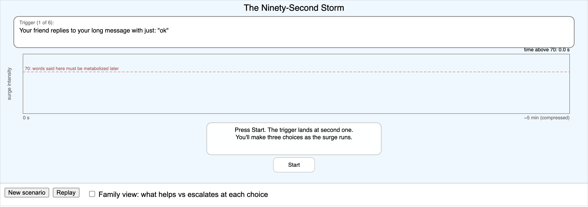](emotion-storm-explorer/index.md)

**[The Ninety-Second Storm Explorer](emotion-storm-explorer/index.md)**   Chapter 11 · p5.js

[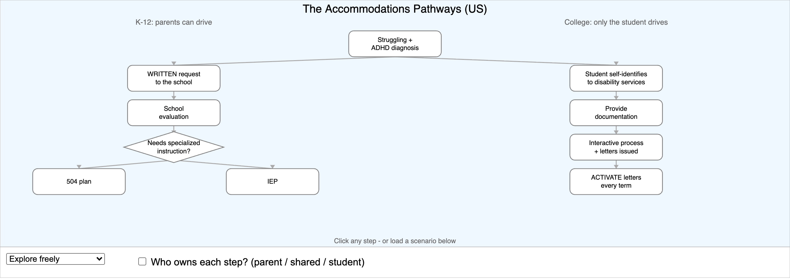](accommodations-pathway-navigator/index.md)

**[The Accommodations Pathway Navigator](accommodations-pathway-navigator/index.md)**   Chapter 12 · p5.js

[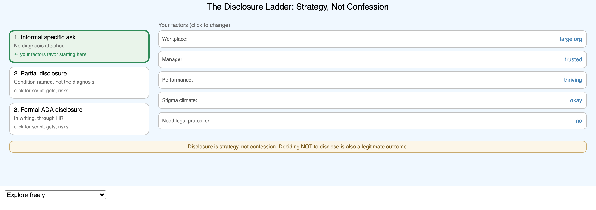](disclosure-decision-navigator/index.md)

**[The Disclosure Decision Navigator](disclosure-decision-navigator/index.md)**   Chapter 13 · p5.js

[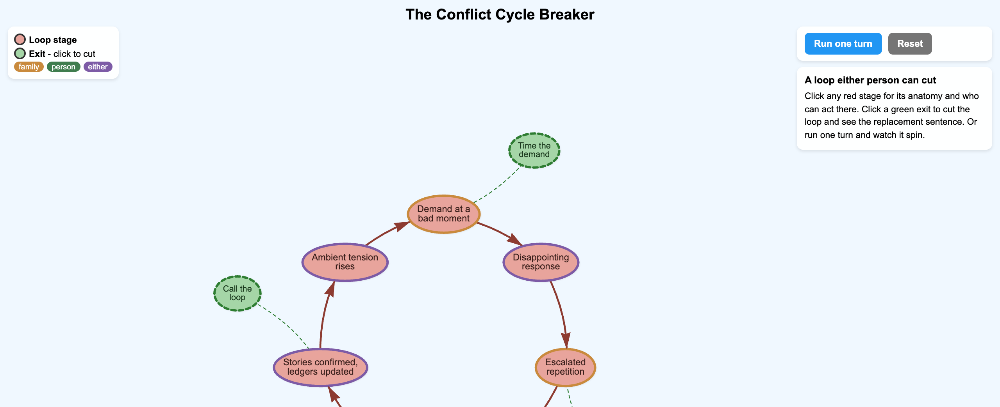](conflict-cycle-breaker/index.md)

**[The Conflict Cycle Breaker](conflict-cycle-breaker/index.md)**   Chapter 14 · vis-network

[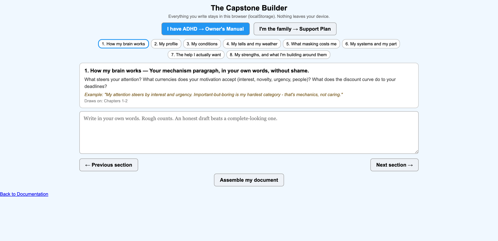](capstone-builder/index.md)

**[The Capstone Builder](capstone-builder/index.md)**   Chapter 15 · HTML/JS

## Full List

| MicroSim | Chapter | Library |
|---|---|---|
| [Attention Spotlight Simulator](attention-spotlight-simulator/index.md) | 1 | p5.js |
| [Three Traits Across Three Ages Explorer](three-traits-explorer/index.md) | 1 | p5.js |
| [Brain Development Timeline](brain-development-timeline/index.md) | 1 | p5.js |
| [Myth or Evidence Sorter](myth-or-evidence-sorter/index.md) | 1 | p5.js |
| [The Stigma Cycle](stigma-cycle-diagram/index.md) | 1 | vis-network |
| [Brain Construction Schedule Explorer](brain-construction-explorer/index.md) | 2 | p5.js |
| [Executive Function Explorer](executive-function-explorer/index.md) | 2 | p5.js |
| [Reward Discounting Simulator](reward-discounting-simulator/index.md) | 2 | p5.js |
| [Symptom and Presentation Explorer](symptom-presentation-explorer/index.md) | 3 | p5.js |
| [Time Blindness Challenge](time-blindness-challenge/index.md) | 3 | p5.js |
| [Lifespan Demands and Scaffolding Explorer](lifespan-scaffolding-explorer/index.md) | 4 | p5.js |
| [The Adult Diagnosis Journey Map](adult-diagnosis-journey-map/index.md) | 4 | p5.js |
| [Anatomy of a Thorough Evaluation](evaluation-anatomy-map/index.md) | 5 | p5.js |
| [The ADHD Comorbidity Map](comorbidity-map/index.md) | 6 | vis-network |
| [Titration Response Tracker](titration-response-tracker/index.md) | 7 | Chart.js |
| [Treatment Evidence Explorer](treatment-evidence-explorer/index.md) | 8 | Chart.js |
| [Next-Action Trainer](next-action-trainer/index.md) | 9 | p5.js |
| [Distraction Defense Lab](distraction-defense-lab/index.md) | 10 | p5.js |
| [The Ninety-Second Storm Explorer](emotion-storm-explorer/index.md) | 11 | p5.js |
| [The Accommodations Pathway Navigator](accommodations-pathway-navigator/index.md) | 12 | p5.js |
| [The Disclosure Decision Navigator](disclosure-decision-navigator/index.md) | 13 | p5.js |
| [The Conflict Cycle Breaker](conflict-cycle-breaker/index.md) | 14 | vis-network |
| [The Capstone Builder](capstone-builder/index.md) | 15 | HTML/JS |
